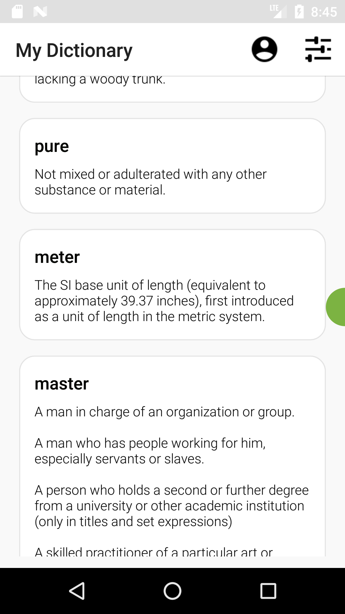
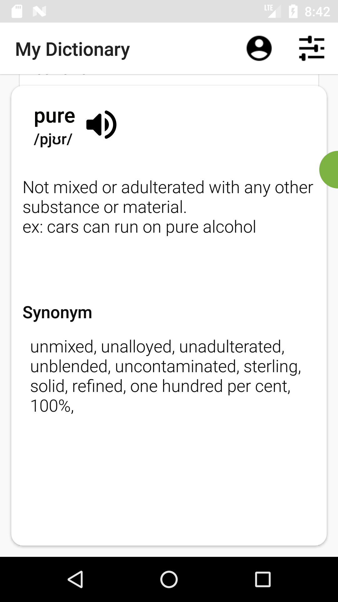
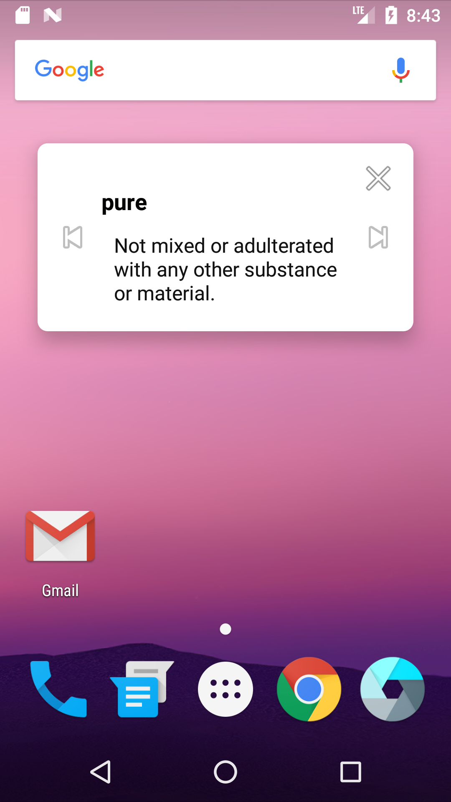
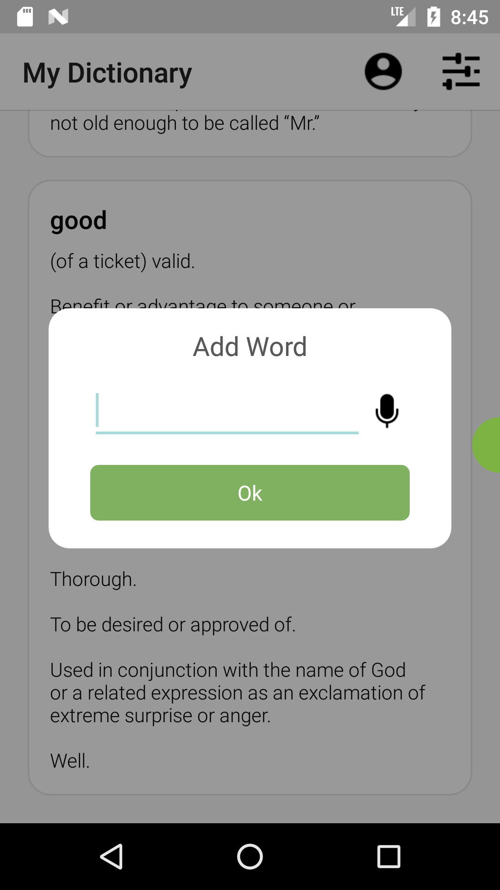

# VocabularyBook Android App
This is a simple application using google [dictionary API](https://dictionaryapi.dev/)  

## Application functionalities
- [x] Search for a word
- [x] Save words into sql database ( room library used )
- [x] User can use speech to text
- [x] Deleting words
- [x] floating window 
- [ ] Oauth login
- [ ] Online database
- [ ] And more in future ...

## ScreenShots

  
   
  
  

 ## LICENSE
 GNU V3.0
